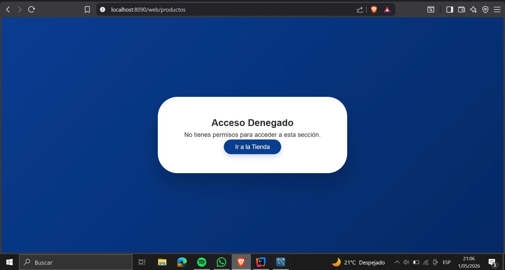

# KinalApp

API REST para gestión de ventas, clientes, productos y usuarios. Desarrollada con Spring Boot como proyecto académico.

---

## Tecnologías utilizadas

- Java 21
- Spring Boot 3.2.0
- Spring Security
- Spring Data JPA
- Thymeleaf
- MySQL
- BCrypt
-POSTMAN
---

## Requisitos Previos
Antes de ejecutar la aplicación, debe estar instalado:
- JDK 17 o superior
- Maven instalado
- Una instancia activa en MySQL (XAMPP, WAMP o MySQL Workbench)
- Postman (para pruebas)

## Instalación y Ejecución
- Clonar repositorio: https://github.com/dgiron-2025071/Act1B2.git
- Pasarse al Repositorio
- cambiar a la rama dgiron-2025071
- abrir IntellijID 
- abrir la carpeta kinalapp
- seleccionar select folder
- darle a this window, trust project 
- ejecutar el programa 
- probar que el codigo ejecute bien correctamente
## Adjunto capturas de pantalla 

## Seguridad implementada

Se integró **Spring Security** para proteger las rutas de la aplicación según el rol del usuario autenticado.

### Roles definidos

| Rol        | Descripción                                         |
|------------|-----------------------------------------------------|
| `ADMIN`    | Acceso total al sistema, incluyendo panel de administración y gestión de usuarios. |
| `VENDEDOR` | Acceso a la gestión de productos, clientes y ventas. |
| `USER`     | Acceso únicamente a la tienda y al carrito de compras. |

### Rutas protegidas

- **Públicas** (sin autenticación): `/css/**`, `/images/**`, `/js/**`, `/auth/**`, `/error`.
- **Tienda y carrito** (`/tienda/**`, `/carrito/**`): accesibles para cualquier usuario autenticado (`ADMIN`, `VENDEDOR`, `USER`).
- **Gestión administrativa** (`/web/productos/**`, `/web/clientes/**`, `/web/ventas/**`, `/web/detalle-ventas/**`): solo `ADMIN` y `VENDEDOR`.
- **Dashboard y usuarios** (`/web/dashboard/**`, `/web/usuarios/**`): exclusivo para `ADMIN`.
- **Perfil del programador** (`/web/programador`): cualquier usuario autenticado.

### Flujo de autenticación

- El inicio de sesión se realiza mediante un formulario personalizado en `/auth/login`.
- Las contraseñas se almacenan encriptadas con **BCrypt**.
- Al autenticarse correctamente, se redirige a la tienda.
- Si el usuario no tiene permisos para una ruta, se muestra una página de error **403 - Acceso Denegado**.

### Usuarios de prueba

| Usuario      | Contraseña       | Rol        |
|--------------|------------------|------------|
| `admin`      | `admin123`       | ADMIN      |
| `vendedor`   | `vendedor123`    | VENDEDOR   |
| `user`       | `user123`        | USER       |

> Los usuarios se crean automáticamente al iniciar la aplicación si no existen en la base de datos.

## Ejecución del proyecto

1. Clonar el repositorio.
2. Configurar la conexión a la base de datos en `application.properties`.
3. Ejecutar `KinalAppApplication`.
4. Acceder a `http://localhost:8090/auth/login`

## Adjunto Pruebas del Spring Security, donde no puede ingresar usuario

